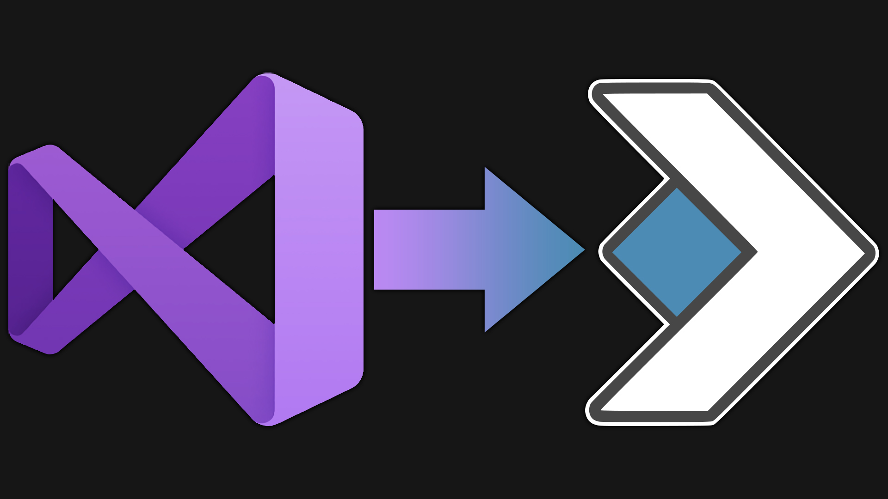
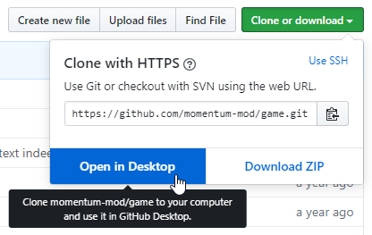
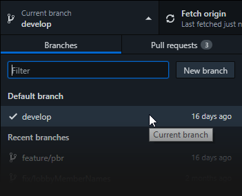
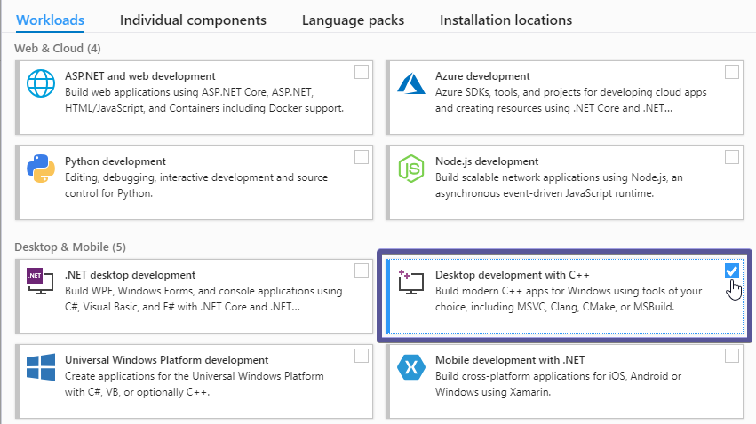
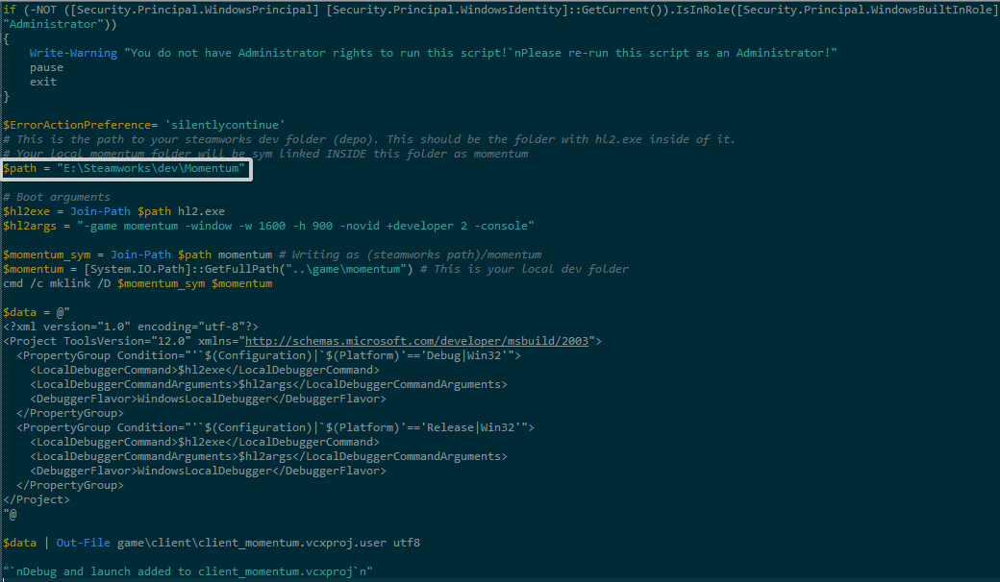
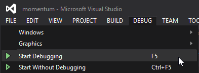

# Build Guide



Table of Contents
- [Build Guide](#build-guide)
  - [Windows](#windows)
    - [Prerequisites](#prerequisites)
    - [Cloning](#cloning)
    - [Building](#building)
  - [Linux](#linux)
    - [Command Line](#command-line)
    - [NetBeans](#netbeans)
      - [Initial Setup](#initial-setup)
      - [NetBeans Configuration](#netbeans-configuration)
  - [MacOS](#macos)

## Windows

This Guide covers the general method of building the latest, publicly-available code from GitHub for Momentum for Windows, Linux and macOS.

---
**NOTE**

This guide is _only_ for the `0.8.7` public preview build since the game is now closed-source.

If you just want to try out the most recent publicly available version, you can grab a ready-to-use, already compiled build from the [Releases page](https://github.com/momentum-mod/game/releases/tag/0.8.7-public-eval). You only need to follow this guide for debugging and development purposes.

---

---

### Prerequisites
To make use of this page, you should:  
- Be using the Administrator account of the machine you're using
- Have a pot of coffee (optional)

---
**NOTE**

You'll need Momentum activated on your Steam account in order to test online features or mount assets from other games automatically!
New Steam keys are currently reserved for users that are making contributions to the game.

---

### Cloning

1. Download [***GitHub Desktop***](https://desktop.github.com/), it will require a bit of setup, and may require an account.
2. Go to the [***Main Page***](https://github.com/momentum-mod/game) and click ***Clone or Download > Open in Desktop***:  

    > You should have cloned the `develop` branch.  
    > If not, switch to it from the top (if you're using GitHub Desktop).  
    > It may also be called `origin/develop`:  
    

---
**NOTE**

Your installation of GitHub Desktop may look different, but should otherwise function the same.

---

### Building
1. Download Momentum Mod on Steam or grab the `MomentumDev` folder from [***Google Drive***](https://drive.google.com/file/d/1HD1Mh8JrCBqP2sh8WJCpfybJGI4BPcZ4/view?usp=sharing).
2. Download [***Visual Studio 2019***](https://visualstudio.microsoft.com/thank-you-downloading-visual-studio/?sku=Community&rel=16).
    > Your installation only requires the "Desktop development with C++" workload:

3. If you downloaded Momentum Mod from Steam, create an extra folder somewhere called `MomentumDev`, and copy everything from your `steamapps/common/Momentum Mod` folder to it. Then delete the `momentum` folder from `MomentumDev`.
    * Otherwise if you downloaded the `MomentumDev` folder from Google Drive, extract it somewhere.
4. Edit the `creategameprojects.ps1` file to point the `$path` variable to the full path of the `MomentumDev` folder.  
    * This script will create a symlink of your `mp/game/momentum` folder into the `MomentumDev` folder automatically for you, which allows you to test changes immediately and run the debugger from Visual Studio.


5. Run `creategameprojects.bat` **as administrator**.


---
**NOTE**

If you can't run it as administrator, start `cmd.exe` as Administrator, then change directory to the Git clone, and run it from `cmd.exe`.

---

6. Open `momentum.sln`, go start the pot of coffee, come back a minute later, and click Build...


    ...then go finish the pot of coffee and pour yourself some.

7. Click *Debug*.  


---
**NOTE**

You can launch with no debugger attached by pressing `CTRL+F5` instead...

...but if a crash occurs no useful information can be gathered!

---

## Linux

### Command Line
1. Install the following dependencies:
```sh
sudo apt-get install build-essential gcc-multilib g++-multilib
```
2. Git clone the [Steam Runtime repository](https://github.com/ValveSoftware/steam-runtime).
3. Go into its directory and run: 
```sh
./setup_chroot.sh --i386
```
4. Download Momentum Mod on Steam **(see the important note at the top of this page)** or from [***Google Drive***](https://drive.google.com/file/d/1tF7Bh6tp3YjaFj2PxybMoPnsavRKAJRK/view).
5. Clone this repository wherever you'd like.
6. Create an extra folder somewhere called `MomentumDev`, and copy all of the files from your Steam's `steamapps/common/Momentum Mod` directory into this folder.  
    * So for example, to get at the game's binaries, it should look like `MomentumDev/momentum/bin`. 
7. Now, delete the `momentum` folder inside `MomentumDev`.
8. Symlink the `mp/game/momentum/` folder from your Git clone over to this `MomentumDev` folder, so that the binaries you end up compiling automatically copy over.  
9. To compile the game, run the following commands in the `mp/src/` directory of your clone:
```sh
./creategameprojects  
sudo schroot --chroot steamrt_scout_i386 -- make -f games.mak
```
10. Make sure Steam is open, and you should be able to run `./hl2.sh -game momentum` in the `MomentumDev` folder to launch the game.

---
**Unfortunate Note**  
Developing on Linux is going to be a chore, and is best reserved for Windows.  
If we ever convert the project to CMake, this unfortunate note will go away, but blame VPC for not generating any good Linux development files for the time being.

---

### NetBeans

This section outlines compiling the game on Linux using the [NetBeans IDE](https://netbeans.apache.org/).

#### Initial Setup

**With sudo**

If project already has been previously compiled with `sudo`:
1. `cd` to `game/mp/`
2. run `sudo chown -R $(whoami):$(whoami) .` where `$(whoami)` _should_ be your local user (not `root`)

---
**NOTE**

These steps can also be combined into a single command like so:
```sh
sudo chown -R $(whoami):$(whoami) game/mp/
```

---

**Without sudo**

1. Replace `groups=sudo` with `groups=<username>` in `/etc/schroot/chroot.d/steamrt_scout_i386.conf` where `<username>` is your local user (not `root`)
2. `cd` to `game/mp/src/`
3. Execute `./creategameprojects` (`chmod +x` if it cannot be run for some reason)
4. Run `schroot --chroot steamrt_scout_i386 -- make -f games.mak` to compile

---
**NOTE**

Step 1 can also be completed with something like:
```sh
sed -i "s/groups=sudo/groups=$(whoami)/g" /etc/schroot/chroot.d/steamrt_scout_i386.conf
```

---

#### NetBeans Configuration

---
**NOTE**

The following steps require the configuration steps from above ([Initial Setup](#initial-setup)) except for compiling

---

1. Install NetBeans (netbeans package)
2. Navigate to `Tools` -> `Plugins`  
	- Navigate to `Settings` -> `Check NetBeans 8.2 Plugin Portal`  
	- Select `Available Plugins` -> `Install C/C++`  
3. Navigate to `Tools` -> `Options`  
	- Navigate to `Editor` -> `Formatting`  
		- `Language`: `All Languages`  
		- `Category`: `Tabs and Indents`  
		- `Expand Tabs to Spaces`: `Check`  
		- `Number of Spaces per Indent`: `4`  
		- `Tab Size`: `4`  
		- `Right Margin`: `120`  
	- Navigate to `Editor` -> `On Save`  
		- `Language`: `All Languages`  
		- `Reformat`: `None`  
		- `Remove Trailing Whitespace From`: `Modified Lines Only`  
4. Navigate to `File` -> `Open Project`  
	- Select `game/mp/src`  
5. Navigate to `File` -> Select `Project Properties`  
	- Under `General` -> Select `Add Source Folder` -> Select `game/mp/src`  
	- Under `Run` -> Configure `Run Directory`: `<path to MomentumDev>` (Server and Client configuration)  
	- Under `Run` -> Configure `Run Command` : `<change run parameters to liking>` (Server and Client configuration)  
6. Select `Run` -> `Build Project (F11)`  
7. Select `Debug` -> `Debug Project (F5)` (`Run` -> `Run Project (F6)` does not work for some reason)  

## MacOS

---
**NOTE**

macOS support has been dropped indefinitely due to the operating system [no longer supporting 32 bit applications](https://support.apple.com/en-ca/HT208436).

---
